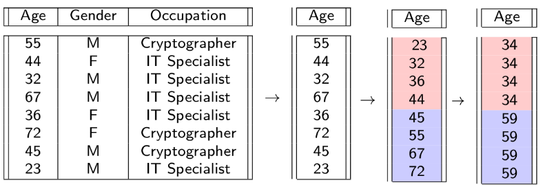

# Laboratoty 12 - K-anonymity

## Survey

[MOK Questionnary](https://docs.google.com/forms/d/1Szf7Yjnig5Cszew8bTZqFUQ1SuYWisGgXgaMQg1lcIM/viewform)

Among the question, you can set your preference on the Exam schedule. 

## Security Model 
Two main statistical disclosure control approaches exist:
- *Utility-first*: priority is given to preserving
certain utility properties. Disclosure risk is
assessed a posteriori (e.g. global recoding).
- *Privacy-first*: a privacy model is adopted to
specify privacy guarantees before
anonymisation. Utility is assessed a posteriori
(e.g. k-anonymity).

## k-anonymity model

A data set satisfies **k-anonymity** for k > 1 if, for each combination of values of quasi-identifiers, at least k records exist in the data set sharing that
combination.

Normally, k is a small positive integer, e.g. 3,4,5.

**Example of 4-anonymity**

In this example, 4-anonymity is applied to *Zip code* and *Age*. Local suppression is applied to *Nationality*.


Notably, k-anonymity does not fix the masking method used for creating k equal records. 
In this case, generalization is applied to *ZIP code* and *Age*.

We may consider to apply a perturbative method as *microaggregation*.

### Microaggregation

**Microaggregation** method splits the elements of an attribute X_j in groups of k or more elements, where elements in a group are as similar as possible, and we replace each element by the corresponding centroid.



* take an attribute *attr*
* sort the attribute = *sattr*
* split elements into groups of k-elements (you may have the last group with more than k elements)
* compute the centroid of each group 
* substitute the values in *attr* by its centroid

**Important** remember the right order of the elements. *sattr* is used only for finding the group to which an element belong and the centroid of that group.


### Data set

Let us consider the data set that we created last week:  


```python
ndata = [[99342.4, 162120.4, 94356.0, 57324.0, 50720.0, 18121.0, 20058.0, 1288.0], [322.0, 534.0, 1021.0, 283.0, 236.0, 304.0, 288.0, 87.0], [317187.0, 647921.6, 305696.4, 204490.0, 173692.0, 68960.0, 61144.0, 1420.0], [3339.0, 4766.0, 3353.0, 1604.0, 1731.0, 1444.0, 1061.0, 1408.0], [33874.0, 35053.0, 36646.0, 32376.0, 33804.0, 33253.0, 35433.0, 170.0], [1380147.8, 1661173.6, 1371050.8, 850248.0, 864924.0, 872040.0, 873722.0, 270.0], [137789111.3, 193032555.9, 193296416.2, 127745453.0, 126976072.2, 126326901.6, 125028454.2, 18426947.4], [85601.0, 119546.0, 40628.0, 37723.0, 37890.0, 38329.0, 35063.0, 164.0], [126772.0, 167378.0, 127768.0, 50714.0, 51647.0, 54433.0, 56397.0, 262.0], [23911563.6, 36789392.6, 24811896.7, 22532121.4, 22575473.2, 22871900.4, 23566772.6, 5305847.3], [18828985.6, 26286194.7, 19488778.2, 17579553.0, 17589724.0, 17693847.0, 17872219.0, 1539510.0], [28.0, 0.0, 5261.9, 0.0, 0.0, 0.0, 0.0, 0.0], [6558.8, 6857.7, 6466.2, 1203.0, 1206.0, 1441.0, 743.0, 1189.0], [6232.0, 6443.0, 5762.0, 5177.0, 5678.0, 5494.0, 6248.0, 5627.0], [5134.0, 5250.0, 5016.0, 2193.0, 2421.0, 2628.0, 2639.0, 3168.0], [1874320.3, 2571813.9, 1953325.8, 1600879.8, 1613125.7, 1626926.2, 1649775.0, 319678.6], [43162.2, 88751.6, 42350.4, 12900.0, 12126.0, 11120.0, 14509.0, 5342.0], [37.0, 21.0, 26.0, 10.0, 8.0, 10.0, 12.0, 26.0], [ 1007.0, 1379.0, 1075.0, 497.0, 468.0, 473.0, 505.0, 466.0], [ 0.0, 2026.0, 0.0, 0.0, 3344.0, 0.0, 0.0, 0.0], [31670.0, 36748.4, 30384.2, 12016.0, 2262.0, 1018.0, 1221.0, 318.0], [117839.2, 56606.6, 54823.1, 41507.0, 36728.0, 35486.0, 36175.0, 714.0], [4282.0, 5095.0, 4172.0, 1674.0, 1903.0, 1999.0, 2408.0, 1816.0], [2570495.9, 3597773.9, 2804998.6, 2660693.2, 2751853.0, 2809613.0, 2842094.0, 287314.7], [90292.0, 129050.0, 90824.0, 44737.0, 45011.0, 45956.0, 47150.0, 1003.0], [12817.0, 16921.0, 14081.0, 6309.0, 3988.0, 3922.0, 3746.0, 10028.0], [18233292.2, 25285087.1, 17590493.4, 14118243.6, 13510404.6, 12992869.6, 12618636.2, 1136378.4], [1396924.0, 1758306.0, 1345420.0, 570200.0, 589432.0, 594255.0, 608301.0, 412.0], [536704.0, 721953.8, 396938.0, 482828.0, 458536.0, 487764.0, 473634.0,3440.0]]
```

In the following file, you can find the polished data set and the funtion to plot the table. 

[ex.py](ex.py)

### Exercise 1 (1.5 p)
- Create a function to anonymise attribute column using microaggregation. 
- Attribute values should be divided into clusters of `k` elements.
- See the template function `ex1` in [ex.py](ex.py).

### Exercise 2 (1.5 p)
- Create a function to anonymise full dataset using microaggregation. 
- See the template function `ex2` in [ex.py](ex.py).
- Try the function on `ndata` with `k = 4` plot the result using the provided function `plot_data` (it will update table in file [table.png](table.png)).


