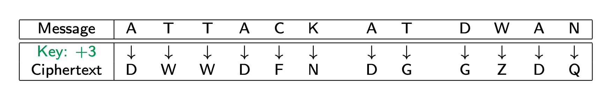
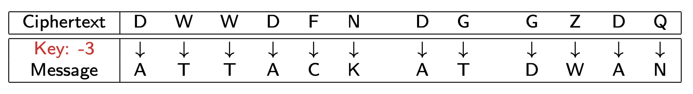
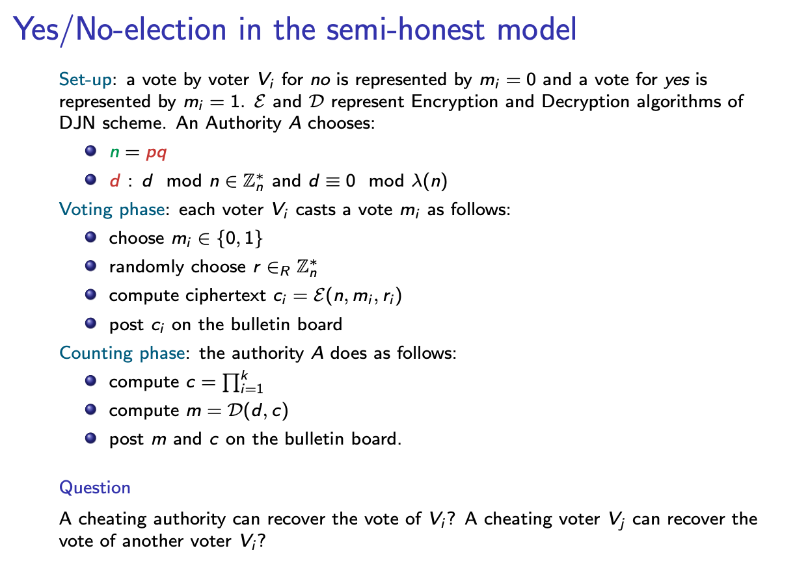

# Laboratory 5 - Homomorphic Encryption

Homomorphic encryption is a form of encryption that allows specific types of computations to be carried out on ciphertexts and generate an encrypted result that, when decrypted, matches the result of operations performed on the plaintexts.

## Caesar cipher (100-44 BC)
- This is a simple substitution cipher (i.e.,symmetric cipher)
- If you have the key, you can encrypt and decrypt
- The default key value is 3

---

**NOTE:** today, the cipher is completely insecure!  
Caesar cipher is only **additively homomorphic**.

---

**Encryption** = shift right by 3 (key value) places on the supported alphabet


**Decryption** = shift left by 3 (key value) places on the supported alphabet


### Ex. 1 (0.5p)
- implement Caesar encryption and decryption function
- implement a function that proves that Caesar cipher is additively homomorphic
- check if the following equation holds:
   - *m1 + m2 = dec(c1, key) + dec(c2, key) = dec(c3, 2 x key)* where
      - *c1 = enc(m1,key)*
      - *c2 = enc(m2,key)*
      - *c3 = Sum(c1,c2)*

## RSA
- It is public-key algorithm for asymmetric encryption and signature generation.
- Published in 1977.
- Based on integer factorization problem.

**Key generation**
- choose random primes *r* and *s*
- compute $n = r * s$, $\phi(n) = (r - 1) * (s - 1)$
- choose public key *pk* so that $gcd(pk, \phi(n)) = 1$
- copmute secret key $sk = pk^{-1} mod \phi(n)$

**Encryption** $c = m^{pk} mod n$

**Decryption** $m = c^{sk} mod n$

### Ex. 2 (0.5p)
- implement RSA encryption and decryption function
- implement a function that proves that RSA cipher is multiplicatively homomorphic
- check if the following equation holds:
   - *m1 x m2 = dec(c1, sk) x dec(c2, sk) = dec(c3, sk)* where
      - *c1 = enc(m1, pk)*
      - *c2 = enc(m2, pk)*
      - *c3 = enc(m1, pk) x enc(m2, pk)*

---

**NOTE:** However, for security, RSA has to pad a message with random bits before encryption. The padding results in RSA loosing the homomorphic property.

---


## Paillier Encryption Scheme

- It is a probabilistic public-key algorithm for asymmetric encryption.
- Published in 1999, used upto now.
- Based on composite residuosity assumption.
- The scheme is an additive homomorphic cryptosystem.

```console
pip3 install phe
```

```python
import phe
```

Check [Doc](https://python-paillier.readthedocs.io/en/develop/) and [Usage](https://python-paillier.readthedocs.io/en/develop/usage.html#usage), Also [useful](https://python-paillier.readthedocs.io/en/stable/phe.html).

### Ex. 3 (1p)
- implement a function that proves Paillier homomorphic properties
- check if the following equation holds:
   - Dec(c1 * c2 mod n^2) = m1 + m2 mod n
   - Dec(c1 * g^m2 mod n^2) = m1 + m2 mod n
   - Dec(c1^{m2} mod n^2) = m1 * m2 mod n
   - Dec(c2^{m1} mod n^2) = m1 * m2 mod n

### Hw. 1 (1p) - Create the e-voting scheme
- Implement e-voting scheme in the semi-honest model.
- Use [damgard-jurik](https://github.com/cryptovoting/damgard-jurik) library, which implements homomorphic encryption system.
- Follow phases as decsribed in slides.



