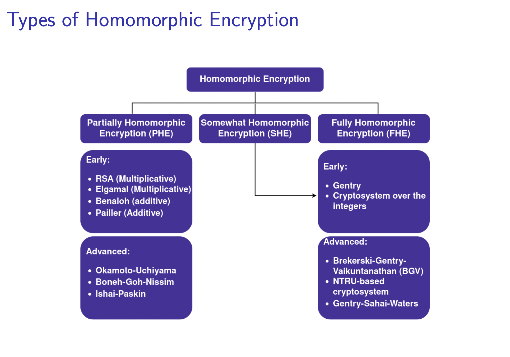
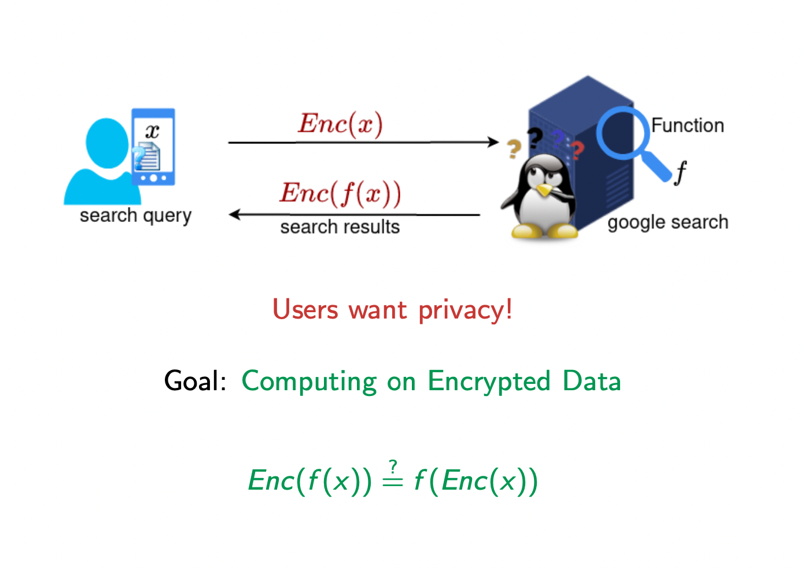

# Laboratory 6 - Fully Homomorphic Encryption and Applications

Fully Homomorphic Encryption (FHE) allows performing any kind of operation (unlimited sums and products). The ability to compute both sums and products on the same encrypted data.

- SUM = XOR
- PRODUCT = AND,

XOR, AND is Turing-complete and any function is a combination of XOR and AND gates.




## Main Applications using FHE



- **Outsourcing storage and computations** without revealing sensitive information:
cloud computing.
- **Private Information Retrieval (PIR)**: a server is holding a large database (e.g., the US patent database), and a client wants to retrieve one record of this database without the server learning which record was retrieved.
- **Multiparty computations**: mutually suspicious parties want to compute a common function on their joint input - next classes.

---

# Fully homomorphic encryption sandbox environment
[Morfix.io](https://morfix.io) allows you to play with FHE in their web browser based sandbox environment.  
It is powered by [Microsoft SEAL](https://github.com/microsoft/SEAL), there is also python [wrapper](https://github.com/Huelse/SEAL-Python).

## Available schemes
- BFV - works with integers
- CKKS - works with floating point numbers

**Bootstraping**
- allows for infinite homomorphic evaluations on encrypted data
- is supported only for CKKS scheme
- use "Rescale a Ciphertext" function

## Ex. 1 - Play with sandbox environment (1p)
- test following homomorphic properties
    - $a \cdot (b + c) = Dec(Enc(a) \cdot (b + Enc(c)))$
    - $a \cdot (b - c) = Dec(a \cdot (Enc(b) - Enc(c)))$
    - $a^2 = Dec(Enc(a)^2)$
    - $(a \cdot b)^2 = Dec((Enc(a) \cdot Enc(b))^2)$
- experiment with different functions

*Hint: Try to rescale ciphertexts when results don't make sense*

---

# Microsoft SEAL
"Microsoft SEAL is an easy-to-use open-source ([MIT licensed](LICENSE)) homomorphic encryption library developed by the Cryptography and Privacy Research Group at Microsoft.
Microsoft SEAL is written in modern standard C++ and is easy to compile and run in many different environments.
For more information about the Microsoft SEAL project, see [sealcrypto.org](https://www.microsoft.com/en-us/research/project/microsoft-seal) [[ref](https://github.com/microsoft/SEAL)]."

Check this [repository](https://github.com/Huelse/SEAL-Python) for python wrapper.  
Follow build [instructions](https://github.com/Huelse/SEAL-Python#build) to build it for Linux, Windows or using Docker.

---

**NOTE:** When installing using docker you should remove `-DSEAL_USE_ZSTD=OFF` flag from Dockerfile, so it uses compatible compression for next exercise.

---

## Ex. 2 - FHE hangman client (1p)
- create simple hangman client that will communicate with server provided in [server.py](server.py)
- use same scheme parameters as server
- encrypt letter that should be checked
- send it to server (endpoint description is lower)
- decrypt response, value *0* means that letter is in given index, random value means there is another letter at given index

Example:
- message on server: "Test"
- checking letter: 's'
- response: `[4592, -5823, 0, 9573]`

*Hint: check [examples](https://github.com/Huelse/SEAL-Python/tree/main/examples) and use `help(seal)` to find possible classes and functions*


Server address will be provided during class.  
You should send requests to `/check_letter` endpoint that:
- expects `POST` request with parameter `letter` that is hexadecimal represenation of `seal.Ciphertext` representing letter that should be checked
- responds with hexadecimal represenation of `seal.Ciphertext` representing check result
- you can use `requests` library
```
requests.post(f'http://SERVER_ADDRESS/check_letter', data={'letter': serialized_ciphertext})
```

*Hint: to serialize ciphertext use `ciphertext.to_string().hex()`, to deserialize it use `context.from_cipher_str(bytes.fromhex(string))`.*


## Hw. 1 - FHE demo in python (1p)
- create and run demo FHE application in python
- you can use `seal` library from previous exercise or any lib you want to try (check [Awesome Homomorphic Encryption](https://github.com/jonaschn/awesome-he))
- demo should show step by step how it works, what it computes and if the conditions are met

## Resources
- [Awesome Homomorphic Encryption](https://github.com/jonaschn/awesome-he)
- [Google open-source FHE](https://github.com/google/fully-homomorphic-encryption)
- https://vitalik.ca/general/2020/07/20/homomorphic.html