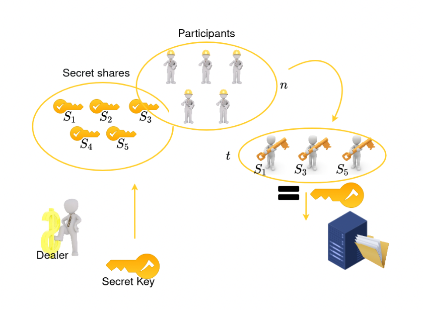
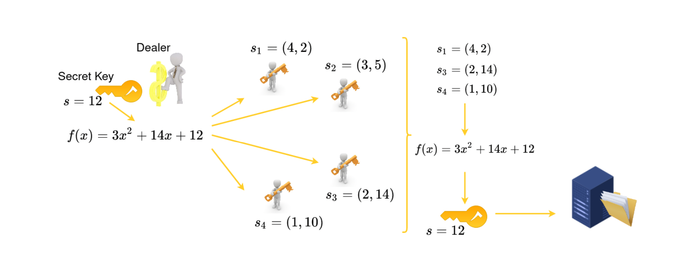
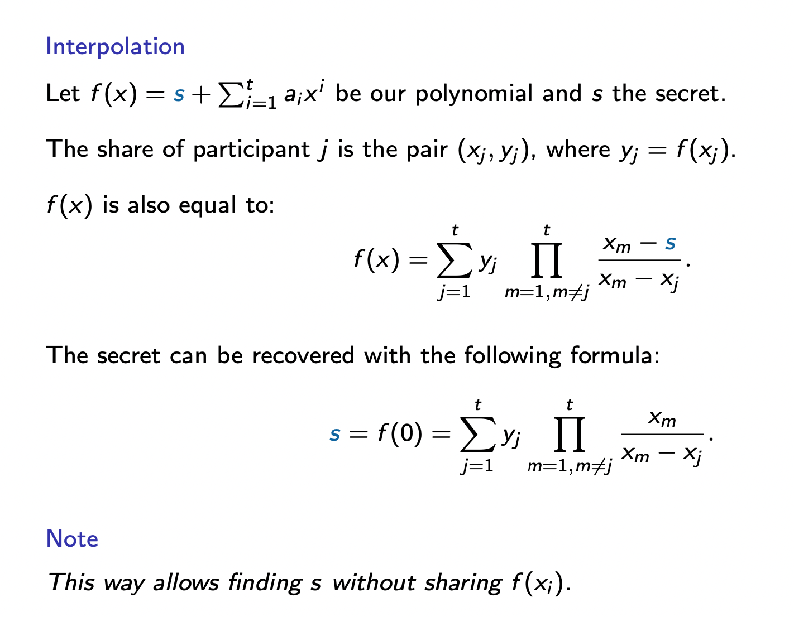
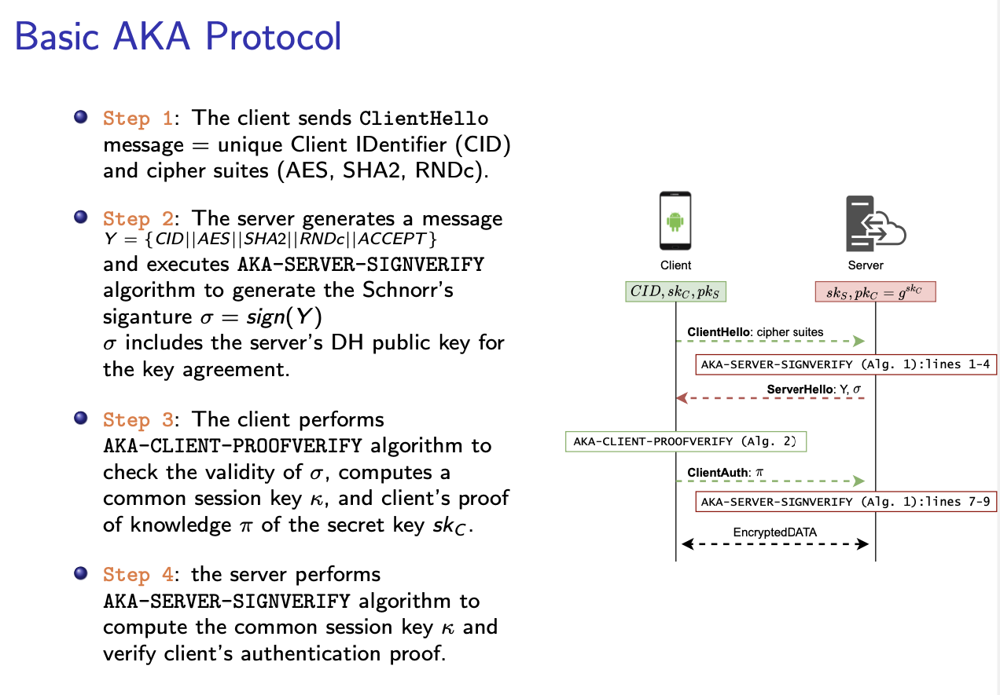

# Laboratory 7 - Secret Sharing

**Secret Sharing** is a cryptographic tool that is used as a building block in many protocols such as *multiparty computation*, *generalized oblivious transfer*, and *attribute-based encryption*.

Secret Sharing allows distributing a secret among a set of parties. Each party owns one share of the secret.
The secret can be recovered only if enough authorized parties combine their shares together.

---
Secret Sharing Idea - The basic idea of secret sharing is to divide the information into several pieces such that some subsets of these pieces can be used to recover the information.

An Intruder needs to:
- get several pieces to steal the information,
- get several pieces to destroy the information.

---

A secret sharing scheme has two requirements:
- **Correctness**: the secret s can be reconstructed by any authorized set of parties.
- **Perfect Privacy**: every unauthorized set cannot learn anything about the secret (in the information theoretic sense) from their shares.

The minimum number of shares needed to reconstruct the secret is called **threshold**. There are constructions with and without threshold.

## Shamir Secret Sharing

Shamir secret sharing scheme is a well-known (t,n)-threshold scheme where n denotes the number of participants involved and t the number of shares needed to reconstruct the secret k.
It is based on: 
- Unique polynomial
- Interpolation problem

**Unique polynomial**: there exists a unique (t − 1)-th degree polynomial that passes through t points in the plane.

### Ex. 1 - Unique polynomial (1.5p)
- Use file `ex1.py`.
- Create functions that simulate the Dealer computations in Shamir scheme. In particular:
  - generate polynomial of defined degree with provided secret,
  - create *n* shares using provided polynomial,
  - reconstruct the secret using Unique polynomial property (solve the system of equations).

### Ex. 2 - Shamir (t,n)-threshold Secret Sharing (0.5p)
- Use file `ex2.py`.
- Create a functon that reconstructs the secret with the method of interpolation.
- Use functions defined in Ex. 1.

## Authentication Key Agreement

AKA is the combination of a key agreement protocol with a digital signature scheme.
AKA protocols not only allow parties to compute the session key but also ensure the authenticity of the involved parties.

### HW. 1 - (1p)
- Simulate any AKA scheme.
- You can use any library that you want.
