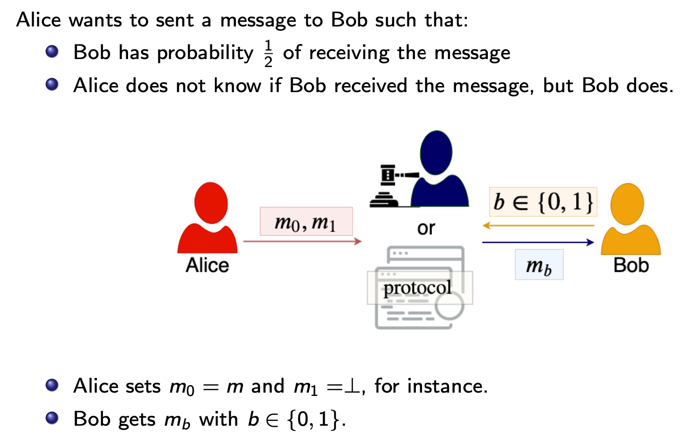
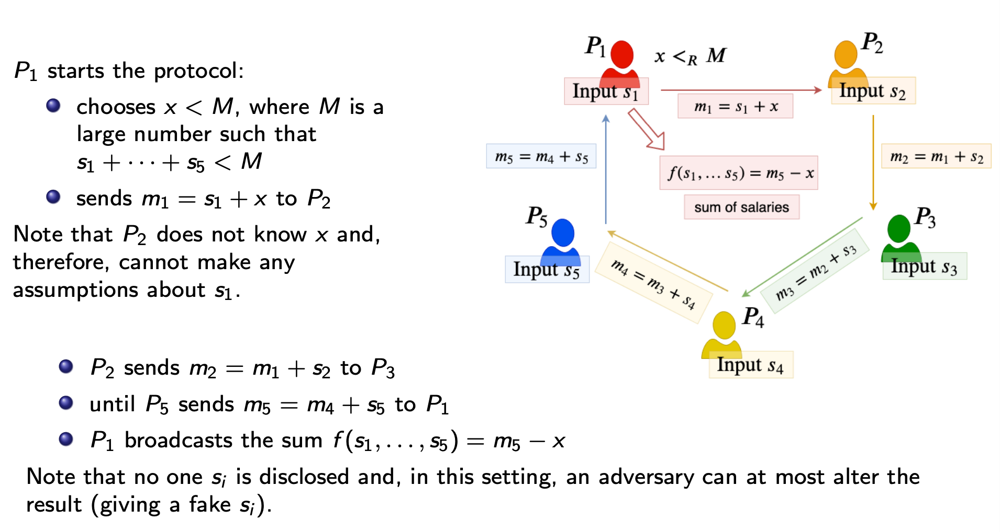
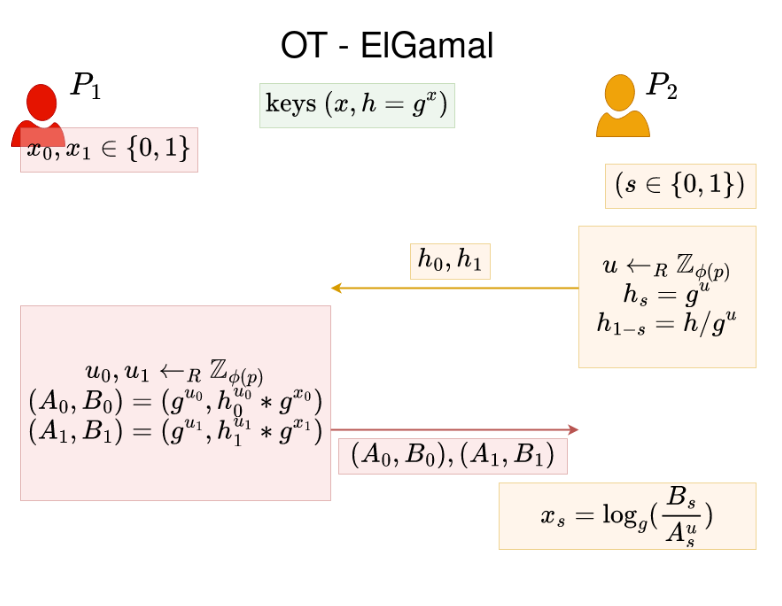
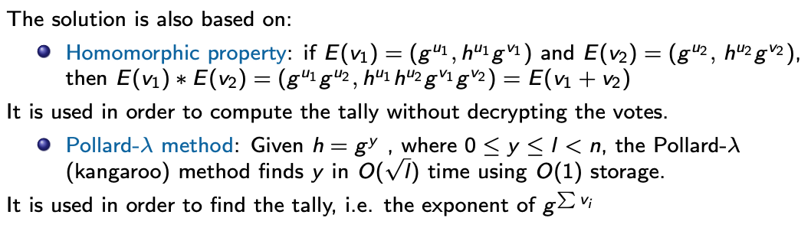
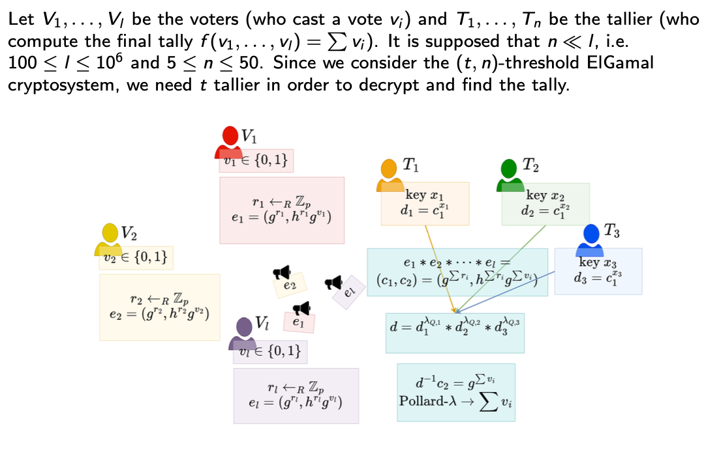
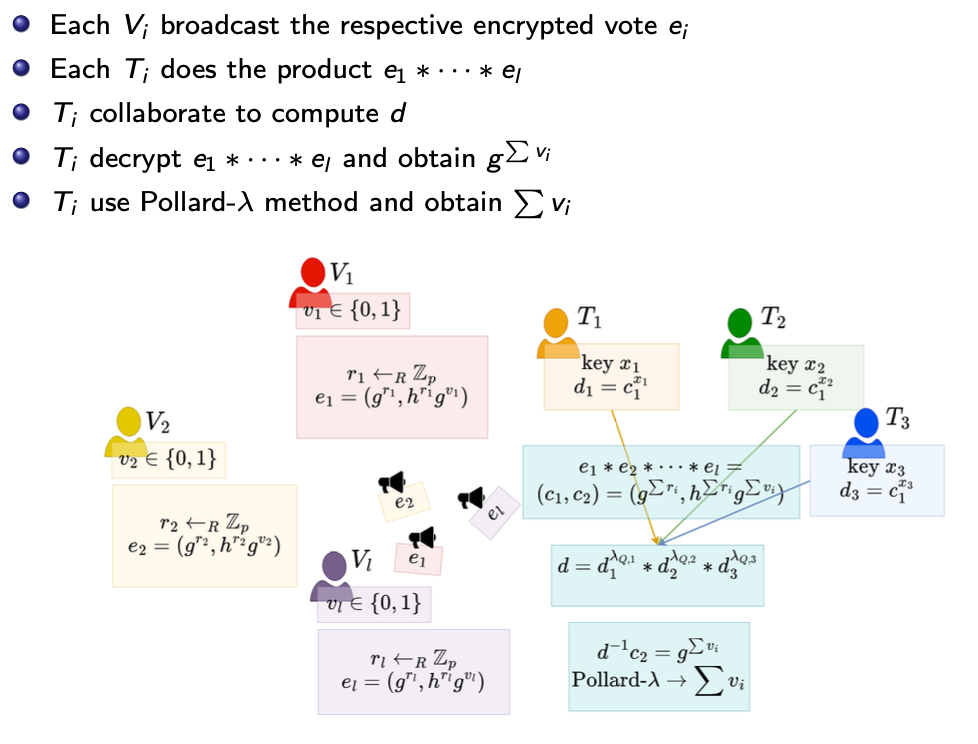

# Laboratory 8 - Secure Multiparty Computation

## Secure Multiparty Computation (sMPC):

* A set of parties with *private inputs* wish to compute some *joint function* of their inputs
* Parties wish to *preserve* some security properties, e.g. *privacy* and *correctness*
* Security have to be preserved againsts *adversarial behaviour* by some of the participants and/or an external party

---
**Definition** - Let P1, ..., Pn be a number of participants each holding a value x1, ..., xn, respectively, for which they want to compute the function f (x1, ..., xn). The problem of secure multiparty computation is to find a protocol which enables P1, ..., Pn to jointly compute f without revealing x1, ..., xn.

---

**Use Cases:**

* **Secure Cloud Computing** - The cloud can safely compute on encrypted data
* **Secure Statistics** - The Yao’s Millionaires’ Problem is a simple example of what can be done
* **Secure Election-Voting** - The data are never decrypted, therefore, votes are hidden
* **Bid Auction** - The offers are encrypted, therefore, no bidder knows how much the other auction participants have bid

## Oblivious Transfer (OT)

Oblivious transfer is an alternative approach to secure computation. OT is sufficiently powerful to construct a secure multiparty computation for any efficiently computable function.

### Ex. 1 - Implement Sum of salaries (0.5p)

Let P1, ..., P5 be 5 parties who earn s1, ..., s5 salaries, respectively. They need to compute the total salary they earn, i.e. f (s1 , ..., s5 ) = sum(si) function

We can image to be in the computational setting, that is:

* PPT adversary and distinguisher (computational security)
* Arbitrary number of corruptions t < n
* Authenticated channels
* Semi-honest adversarial behaviour
* Real model (no trusted party)
* Point-to-point network

### Ex. 2 - Oblivious Transfer (0.5p)

* Implement Oblivious Transfer (OT) protocol derived from ElGamal scheme
* Follow functions structure defined in [ex2.py](ex2.py) file

## Electronic Voting
Assume the votes are binary, “yes” or “no”. The function to be evaluated is $f(v_1, ..., v_I) = \sum_{i=1}^{I} v_i$, where $v_1, ... ,v_I \in \{0,1\}$.

Setting:

- Computational setting
- Semi-honest adversarial behaviour
- Broadcast network

Security requirements:

- Eligibility: only eligible voters can cast at most one vote
- Privacy: the vote must be private
- Universal Verifiability: the final tally is computed fairly
- Robustness: any cheating voter can be detected and discarded

We need:

- Unique polynomial to reconstruct the key able to decrypt the tally/result.
- ElGamal homomorphic property to compute the tally without disclosing the votes.
- Pollard-λ method to recover the tally/result.

Solution: 

### Hw. 1  - Implement Electronic Voting (2p)
- Parameters:
    - *p* - prime modulus defining $\mathbb{Z}_p$
    - *g* - subgroup generator
    - *q* - order of generator
    - *t*, *n* - threshold parameters (*t* out of *n* parties are needed to reconstruct secret)
- Implement `Tallier` class that will support distributed key generation and partial decryption.
    - distributed key generation:
        - choose secret $s_i$ and compute $g^{s_i}$,
        - create shares of the secret and share them privately with other talliers,
        - compute public key $h = \prod_{i=1}^n g^{s_i}$,
        - compute share of private key $x_i$ as sum of received shares.
    - partial decryption: $d_i = c_1^{x_i}$
- Implement `encrypt` function that will encrypt vote using talliers public key.
    - $r \gets_R \mathbb{Z}_{q}$
    - $(c_1, c_2) = (g^r, g^v h^r)$
- Implement `decrypt` function that will reconstruct the message from partial decryptions.
    - $m = \frac{c_2}{\prod_{i = 1}^t d_i^{\lambda_{Q, i}}} \mod p$
    - $\lambda_{Q, i} = \prod_{j \in Q \setminus {i}} \frac{j}{j - i} \mod q$
- You can use functions from [lab7](../lab7/ex1.py).

---

[Threshold ElGamal cryptosystem](https://pypi.org/project/threshold-elgamal/)

---
