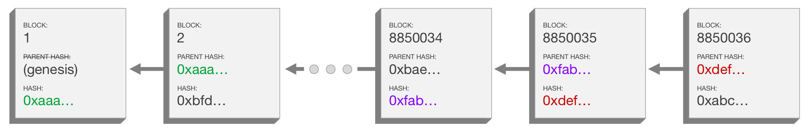

# Laboratory 9 - Blockchain

A **Blockchain** is a chain of blocks that contain information. It is a specific type of database that differs from a typical database in the way it stores information; blockchains store data in blocks that are then chained together.

It is a distributed ledger that is completely open to anyone. They have an interesting property: once some data has been recorded inside a blockchain, it becomes very difficult to change it.

Each block contains some data, the _hash of the block_ and the _hash of the previous block_. The data that is stored inside a block depends on the type of blockchain. For example, the Bitcoin blockchain contains transaction details including the _sender_, _receiver_, and _amount of coins_.

The hash identifies a block and all of its contents, and it's always unique, just as a fingerprint. Once a block is created, its hash is being calculated. Changing something inside the block will cause the hash to change, so it is very useful to detect changes to the blocks.

The third element inside each block is the hash of the previous block. This effectively creates a chain of blocks, and it's technique that makes a blockchain so secure.

Let's take the following figure as an example:



As you can see, each block has a hash and the hash of the previous block. So block number 8850036 points to block number 8850035, and number 8850035 points to number 8850034.

Now the first block is a bit special, it cannot point to previous blocks because it's the first one. We call this the _genesis block_.

---

### Ex. 1, 2, 3 - Custom Blockchain (2p)

* create your own blockchain. In particular,
    * create the blockchain class with two attributes:
        * ```chain = []```: list of blocks
        * ```pending_transactions = []```: list of pending transactions
    * create three functions with the following prototype:
        * ```def new_block(self, previous_hash=None, difficulty=0):```, creates a new block, confirming pending transactions (1p)
        * ```def new_transaction(self, sender, recipient, amount):```, creates a transaction and adds it to the list of pending transactions, returns the transaction id (1p)
        * ```def search_transaction(self, transaction_id):```, searches for a transaction in the blockchain and returns the block where it is found (1p)
    * the main routine should look as follows:
         ```
          blockchain = Blockchain()
          t1 = blockchain.new_transaction("Satoshi", "Mike", '5 MOK')
          t2 = blockchain.new_transaction("Mike", "Satoshi", '1 MOK')
          blockchain.new_block()
         ```
    * do not forget to create the genesis block!


* the structure of the block should contain the following information:
    * ```index```: index of the block in the chain list, incremental
    * ```timestamp```: current timestamp
    * ```difficulty```: 0 (not used now)
    * ```transactions```: list of confirmed transactions
    * ```transactions_hash```: hash of list of confirmed transactions
    * ```previous_hash```: hash of the last block
    * ```nonce```: none (not used now)


* the structure of the transaction should contain the following information:
    * ```id```: first six digits of the transaction hash
    * ```timestamp```: current timestamp
    * ```sender```: the one who sends the amount
    * ```recipient```: the one who receives the amount
    * ```amount```: amount to be sent

---

## Proof of Work

Now let's say that you tamper with the second block. This causes the hash of the block to change as well. In turn, that will make block 3 and all following blocks invalid because they no longer store a valid hash of the previous block. So, changing a single block will make all following blocks invalid.

However, using hashes is not enough to prevent tampering. Computers these days are very fast and can calculate hundreds of thousands of hashes per second. You could effectively tamper with a block and recalculate all the hashes of other blocks to make your blockchain valid again. So to mitigate this, blockchains have something called _proof-of-work_.

**Proof-of-work** is a mechanism that slows down the creation of new blocks. In case of Bitcoin, it takes about 10 minutes to calculate the required proof-of-work and add a new block to the chain. This mechanism makes it very hard to tamper with the blocks because if you tamper with 1 block, you will need to recalculate the proof-of-work for all the following blocks. So, the security of a blockchain comes from the use of hashing and the proof-of-work.

---

### Hw. 1 - Custom Proof of Work (1p)

* create a function to simulate the proof of work and modify the ```new_block``` function to compute it before adding a block:
    * ```def proof_of_work(self, block, difficulty):```, computes the proof of work for the current block and returns the nonce according to difficulty
    * the difficulty indicates the number of 0's the block hash will have at the end (e.g. difficulty = 6, block hash ends in 6 zeros), difficulty ranges from 0 to 8
    * the nonce is an integer that is incremented by 1 at each iteration, if the block hash does not match the expected difficulty, it is incremented and recalculated
    * try different hash functions (MD5, SHA1, SHA256, etc.) to compute the proof of work and compare the results, which one is faster and which one is slower?
    * _hint_ - the function should be able to be called like this: ```block['nonce'] = self.proof_of_work(block, difficulty)```

---
